<div align="center">

# Loom

**A package manager for AI skills.**

Loom installs, inspects, and authors reusable skills for AI agents —
Claude Code, Codex, Cursor, and anything else that loads a skills folder.
Manifests describe how to fetch a skill; Loom weaves them into place.

[Browse skills](https://wess.io/loom) · [Documentation](https://wess.io/loom/docs.html) · [Author a skill](#authoring-a-skill)

<br>



</div>

---

## What is Loom?

AI agents are increasingly extended with **skills**: small, self-contained bundles
of instructions and helper files (a `SKILL.md` plus assets) that teach an agent how
to do something — fill a PDF form, build an MCP server, design a poster.

The skills themselves live in git repos all over the internet. There was no clean
way to discover them, pin a version, install them into the right place for your
agent, or share your own. Loom is that missing layer.

It borrows its model from [Homebrew](https://brew.sh):

- A **manifest** (`<skill_name>.yml`) is a tiny recipe — like a formula. It never
  contains the skill payload, only where to fetch it and how to install it.
- A **repository** is a folder of manifests (this repo's [`skills/`](skills) folder) —
  like a tap.
- The **`loom` CLI** resolves a manifest, fetches the payload from its source, and
  installs it into your agent's skills directory.

```
manifest (skills/pdf.yml)  ──▶  loom install pdf  ──▶  ~/.claude/skills/pdf/
   describes the source           fetches + verifies        ready for the agent
```

## Install

Loom is a single Rust binary. Pick whichever you like:

### Homebrew (macOS & Linux)

```sh
brew install wess/packages/loom
```

### Install script (macOS & Linux)

```sh
curl -fsSL https://raw.githubusercontent.com/wess/loom/main/scripts/install.sh | sh
```

Detects your OS and architecture, downloads the matching release, verifies its
checksum, and drops `loom` on your `PATH`. Set `LOOM_VERSION` to pin a version or
`LOOM_BIN_DIR` to choose the install directory.

### Prebuilt binaries

Grab a `.tar.gz` for your platform from the
[releases page](https://github.com/wess/loom/releases) — builds are published for
macOS and Linux on both `x86_64` and `aarch64` — then extract `loom` onto your
`PATH`.

### From source

```sh
git clone https://github.com/wess/loom
cd loom
cargo install --path .
```

You need `git` on your `PATH` (Loom shells out to it for git sources, exactly like
Homebrew does).

## Quickstart

```sh
loom update                 # sync the skill repository
loom search pdf             # find a skill
loom info pdf               # inspect its manifest
loom install pdf            # install it for the default agent (Claude Code)
loom list                   # see what's installed
loom install pdf --agent codex   # install the same skill for a different agent
loom upgrade                # bump everything to the repo's latest versions
loom remove pdf             # uninstall
```

By default skills install into the **Claude Code** skills folder
(`~/.claude/skills`). Run `loom agents` to see every configured target, and use
`--agent <id>` to pick one.

## Commands

| Command | What it does |
| --- | --- |
| `loom install <skill> [--agent]` | Fetch and install a skill. `<skill>` can be a repo name or a path to a local `.yml`. |
| `loom remove <skill> [--agent]` | Uninstall a skill (aliases: `uninstall`, `rm`). |
| `loom list [--agent]` | List installed skills (alias: `ls`). |
| `loom search <query>` | Rank repository skills by name, description, and keywords. |
| `loom info <skill>` | Show a skill's full manifest and install status. |
| `loom update` | Clone/pull the skill repository from its configured remote. |
| `loom upgrade [skill] [--agent]` | Reinstall installed skills whose repo version has moved on. |
| `loom new <name> [--out]` | Scaffold a new manifest to author from. |
| `loom init [--url] [--ref] [--out]` | Author a manifest interactively; `--url` imports defaults by inspecting a repo. |
| `loom publish <skill> [--repo] [--execute]` | Open a PR adding a manifest to the repository (prints the plan unless `--execute`). |
| `loom lint [path]` | Validate one manifest, or every manifest in the repo. |
| `loom test <skill>` | Fetch and stage a skill in a scratch dir to prove the manifest resolves — without touching any agent. |
| `loom generate <url> [--ref] [--out]` | Inspect a skills repo URL and synthesize a manifest per discovered skill (alias: `create`; URL may also be passed as `--url`). |
| `loom index [--out]` | Build the JSON search index the website consumes. |
| `loom agents` | List the agents Loom can install into. |
| `loom doctor` | Check the environment for common problems. |

Run `loom <command> --help` for details on any one.

## The manifest format

A manifest is a single YAML file named `<skill_name>.yml` (or `.yaml`). It is the
only thing that lives in a Loom repository.

```yaml
name: pdf                     # unique id, lowercase
version: 1.0.0                # the version this manifest pins
description: Read, fill, split, and generate PDF documents.
homepage: https://github.com/anthropics/skills
license: MIT                  # SPDX id (optional)
authors:                      # optional but recommended
  - Anthropic <support@anthropic.com>
keywords: [pdf, documents, forms]   # optional, improves search
compatibility: [claude-code, codex] # agents known to work

source:                       # where the payload comes from
  type: git                   # git | archive
  url: https://github.com/anthropics/skills
  ref: v1.0.0                 # git tag/branch/commit (git only)
  # sha256: <hex>             # required for archive sources
  subdir: skills/pdf          # path within the repo that holds the skill

install:
  entry: SKILL.md             # the file the agent loads first
  files: []                   # optional allow-list; empty copies everything
```

### Fields

| Field | Required | Notes |
| --- | --- | --- |
| `name` | yes | Lowercase, no whitespace. |
| `version` | yes | Semver-ish string this manifest pins. |
| `description` | yes | One line shown in search and on the website. |
| `homepage` | yes | `http(s)` URL. |
| `license` | no | SPDX identifier, e.g. `MIT`. |
| `authors` | no | Free-form `Name <email>` strings. |
| `keywords` | no | Search tags. |
| `compatibility` | no | Agent ids this skill supports. |
| `source.type` | yes | `git` or `archive`. |
| `source.url` | yes | Clone URL (git) or tarball URL (archive). |
| `source.ref` | git | Tag, branch, or commit to check out. |
| `source.sha256` | archive | Checksum the downloaded `.tar.gz` is verified against. |
| `source.subdir` | no | Sub-path inside the source that holds the skill. Omit if the repo root *is* the skill. |
| `install.entry` | no | Entry file to verify after install. Defaults to `SKILL.md`. |
| `install.files` | no | Explicit relative paths to copy. Empty copies the whole subdir. |

`loom lint` distinguishes **errors** (make a manifest uninstallable) from
**warnings** (advisory quality nits, like a missing author or an unpinned git ref).

## Authoring a skill

You publish a skill by adding a manifest to the [`skills/`](skills) folder — you never
upload the skill payload here, only the recipe.

```sh
# 1. author a manifest interactively (or `loom new my-skill` for a bare template)
loom init

# 2. edit skills/my-skill.yml — point source.url / source.subdir at your repo

# 3. validate it
loom lint skills/my-skill.yml

# 4. prove it actually fetches and the entry file is present
loom test my-skill

# 5. open a pull request adding skills/my-skill.yml
loom publish my-skill --execute
```

`loom init` walks you through every field, validates as you go, and can pre-fill
answers by inspecting an existing repo (`loom init --url https://github.com/you/skills`).
`loom publish` forks the repository, commits your manifest to a branch, and opens
the PR with `gh` — run it without `--execute` first to see exactly what it will do.

### Already have a repo full of skills?

Let Loom write the manifests for you. `loom generate` clones a repo, finds every
folder containing a `SKILL.md`, reads its front matter, and emits a ready-to-edit
manifest for each — detecting the license and repo owner along the way.

```sh
loom generate https://github.com/you/skills --ref v1.0.0 --out skills/
# `create` is an alias, and the URL can be a flag if you prefer:
loom create --url https://github.com/you/skills --ref v1.0.0 --out skills/
```

Review the output, run `loom lint`, and open a PR.

## How it works

- **Git sources** are shallow-cloned with the system `git` at the pinned `ref`.
- **Archive sources** are downloaded over HTTPS, verified against `sha256`, and
  unpacked. A single wrapping top-level directory is transparently flattened.
- The `subdir` is resolved against the fetched payload, and its contents are copied
  into `<agent skills dir>/<name>/`. The `entry` file is checked to exist.
- Loom records what it installed where in a small registry so it can `list`,
  `upgrade`, and cleanly `remove` across multiple agents.

Loom keeps all of its own state under a single prefix, `~/.loom` (override with the
`LOOM_HOME` environment variable):

```
~/.loom/
  config.json     agents and repo settings
  state.json      the installed-skill registry
  cache/          clones, downloads, and scratch build dirs
```

## Configuring agents

`~/.loom/config.json` maps agent ids to the folder each one loads skills from.
Defaults ship for `claude-code`, `codex`, and `cursor`; edit the file to add your
own or change a path.

```json
{
  "agents": {
    "claude-code": { "label": "Claude Code", "skills_dir": "~/.claude/skills" },
    "codex":       { "label": "OpenAI Codex", "skills_dir": "~/.codex/skills" }
  },
  "default_agent": "claude-code"
}
```

## The website

The site under [`docs/`](docs) is a static, dependency-free GitHub Pages site with
client-side package search. Its search index is generated straight from the
`skills/` folder:

```sh
loom index --out docs/skills.json
```

Run that whenever manifests change (a CI job is the natural home for it) and the
website stays in sync with the repository.

## Development

```sh
cargo build          # build the binary
cargo run -- --help  # run it
cargo test           # run tests
```

The source is organized by domain, one small module per concern:

```
src/
  cli/        argument parsing and dispatch
  commands/   one file per subcommand
  manifest/   the manifest type, parsing, and linting
  repo/       reading and searching the skills folder
  fetch/      git / archive fetching and checksums
  install/    installing, removing, and the state registry
  generate/   synthesizing manifests from a repo
  site/       building the website search index
  config/     agents and settings
  paths/      filesystem locations
  output/     terminal formatting
```

## License

MIT.
